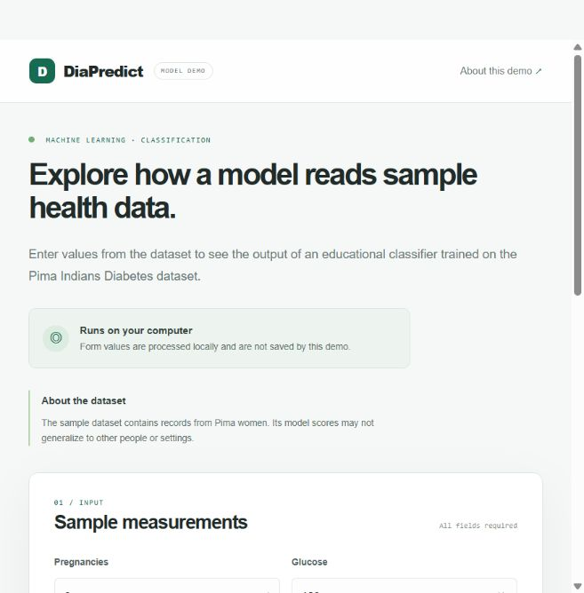
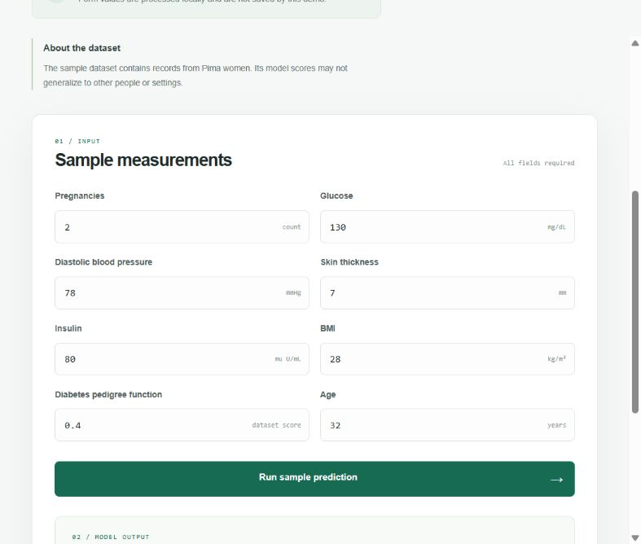
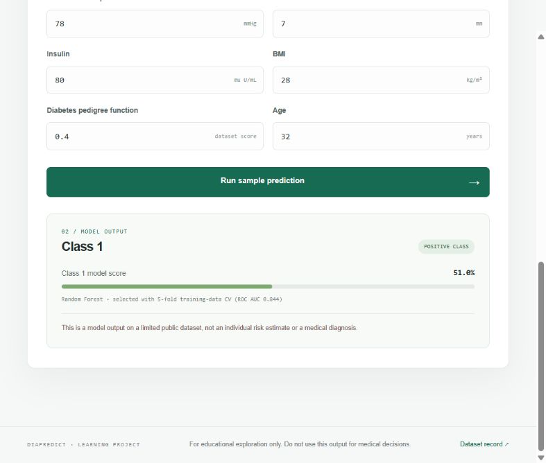
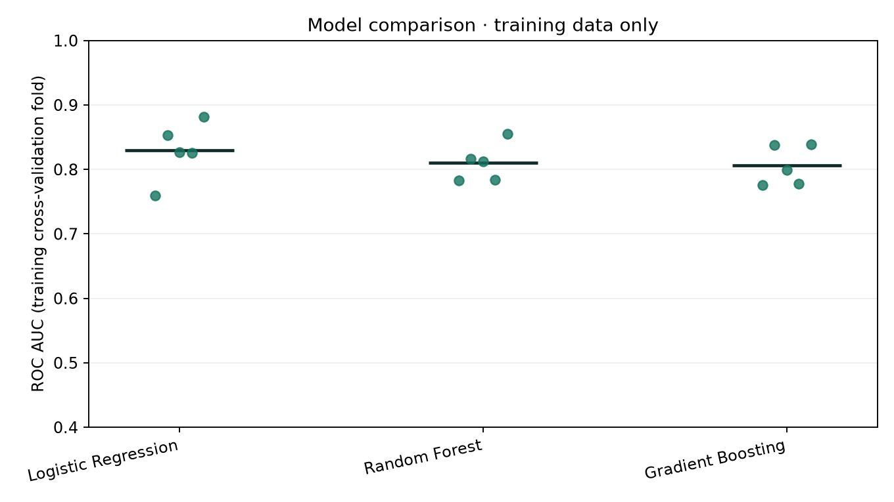
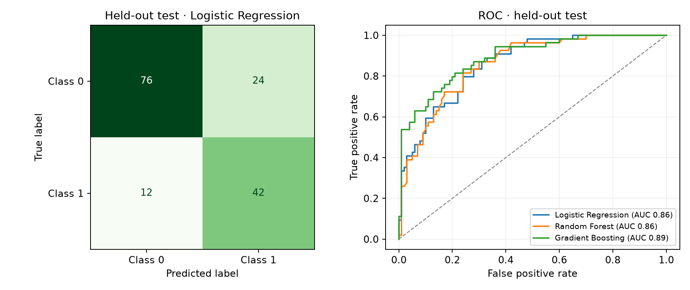
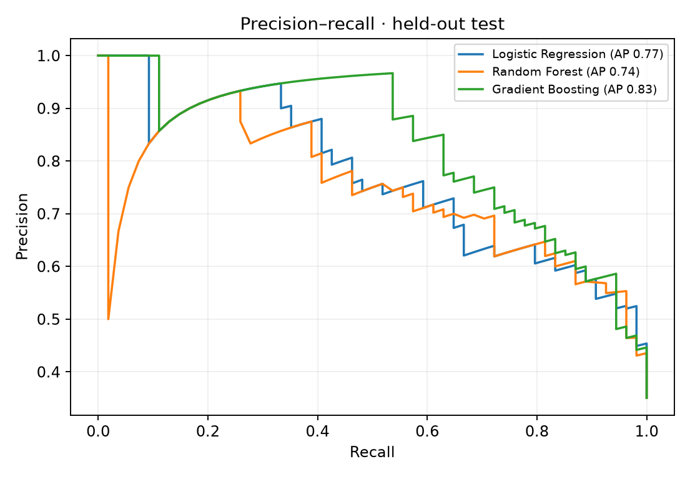

# Diabetes Prediction Using Machine Learning

An educational machine-learning project that compares binary classifiers on the Pima Indians Diabetes dataset and provides a local Flask demo. It is intended to show a reproducible data and model workflow; it is **not a medical diagnostic tool**.

## Demo screenshots







The screenshots show one example submission. The displayed class and score are model outputs on a limited dataset, not a person's diabetes risk.

## Features

- Compares Logistic Regression, Random Forest, and Gradient Boosting.
- Uses stratified 5-fold cross-validation on a training split to select a model by mean ROC AUC.
- Evaluates the selected model on a held-out test split and reports accuracy, precision, recall, F1, ROC AUC, PR AUC, and a confusion matrix.
- Treats zero-valued glucose, blood pressure, skin thickness, insulin, and BMI entries as missing; median imputation and scaling are fitted inside each pipeline to avoid preprocessing leakage.
- Limits model evaluation to two parallel workers to keep local runs responsive on typical laptops.
- Generates cross-validation, confusion-matrix, ROC, and precision-recall charts, plus a JSON metrics report.
- Includes a local-only Flask form with numeric validation. Submitted values are not stored by the app.

## Dataset

The included 768-row CSV is at `data/diabetes.csv`. It is mirrored from [jbrownlee/Datasets](https://github.com/jbrownlee/Datasets/blob/master/pima-indians-diabetes.data.csv); see the [UCI Machine Learning Repository dataset record](https://archive.ics.uci.edu/dataset/34/diabetes). It contains eight measurements and a binary `Outcome` label (`0` or `1`). Its records concern Pima women; its small size and population limit how broadly results can be interpreted.

For command-line evaluation, a replacement CSV must contain the five named measurement columns used by the zero-as-missing rule, other numeric predictor columns, and a binary `Outcome` column. The Flask demo expects the standard eight Pima feature columns because its form maps directly to those measurements.

## Requirements and setup

Use Python 3.11 or newer.

### Windows PowerShell

```powershell
python -m venv .venv
.\.venv\Scripts\python.exe -m pip install -r requirements.txt
```

### macOS or Linux

```bash
python3 -m venv .venv
./.venv/bin/python -m pip install -r requirements.txt
```

## Run the web demo

Windows PowerShell:

```powershell
.\.venv\Scripts\python.exe app.py
```

macOS/Linux:

```bash
./.venv/bin/python app.py
```

Open <http://127.0.0.1:5000>. The app trains and selects a demo model when it starts; this takes a short time. Stop it with `Ctrl+C` in the terminal running Flask. It binds to the local computer only.

## Run evaluation and make charts

Windows PowerShell:

```powershell
.\.venv\Scripts\python.exe diabetes_prediction.py
```

macOS/Linux:

```bash
./.venv/bin/python diabetes_prediction.py
```

By default, the script writes these artifacts to `reports/`:

- `cross-validation-roc-auc.png` — the five training-fold ROC AUC values for each model; short lines mark the mean.
- `held-out-confusion-and-roc.png` — the selected model's confusion matrix and held-out ROC curves.
- `held-out-precision-recall.png` — held-out precision-recall curves.
- `metrics.json` — fold-level and held-out metrics, with the selection rule recorded.

### Generated evaluation charts







You can choose a different CSV or report directory:

```powershell
.\.venv\Scripts\python.exe diabetes_prediction.py --data .\data\diabetes.csv --report-dir .\reports
```

## Run automated checks

```powershell
.\.venv\Scripts\python.exe -m unittest discover -s tests -v
```

The tests cover the included data, missing-value handling, model pipeline prediction, and valid/invalid Flask form submissions. They check software behavior, not medical performance.

## Evaluation notes

The script uses a fixed random seed and a stratified 80/20 train/test split. Cross-validation model selection runs only on the training split; the held-out test set is reserved for final evaluation. Metrics are estimates from this dataset and split, not guarantees of future performance. ROC AUC summarizes ranking across thresholds; the reported PR AUC is scikit-learn's average precision summary of the precision-recall curve. Precision, recall, F1, and the confusion matrix offer additional views of classification behavior.

With the included data and current fixed seed, Logistic Regression was selected by training cross-validation (mean ROC AUC `0.830`, fold standard deviation `0.041`). The held-out metrics for all candidates were:

| Model | Accuracy | Precision | Recall | F1 | ROC AUC | PR AUC |
| --- | ---: | ---: | ---: | ---: | ---: | ---: |
| Logistic Regression | 0.766 | 0.636 | 0.778 | 0.700 | 0.860 | 0.771 |
| Random Forest | 0.766 | 0.629 | 0.815 | 0.710 | 0.858 | 0.744 |
| Gradient Boosting | 0.799 | 0.709 | 0.722 | 0.716 | 0.889 | 0.830 |

Gradient Boosting scored higher on this particular held-out split, even though Logistic Regression had the highest mean ROC AUC in training cross-validation. The model choice stays based on training data; using the held-out test repeatedly to select a model would make the final estimate less independent. Logistic Regression's held-out confusion matrix (actual classes as rows `0`, `1`; predicted classes as columns `0`, `1`) was `[[76, 24], [12, 42]]`. These are results from one fixed split, not clinical performance claims. Re-run the script to regenerate the report artifacts.

The Flask demo performs its own 5-fold comparison on the full included dataset before fitting the demo model, so its displayed model may differ from the held-out evaluation report. Its cross-validation score is not the same as a held-out test score.

The Flask page displays a model score for the positive class. It is not calibrated or validated as an individual probability of disease. Threshold changes and calibration can be explored as machine-learning exercises, but this dataset cannot support clinical recommendations.

## Limitations and responsible use

- This is a small, historical, population-specific dataset; results may not generalize to other groups or settings.
- A good metric on this dataset does not establish clinical usefulness, safety, fairness, or diagnostic accuracy.
- The demo score is a model output, **not a personal risk estimate**. Do not use the page, output, or charts to make medical decisions.
- Use only fictional/sample measurements in the demo. The app does not save form submissions, but it is not designed or approved for real patient data.
